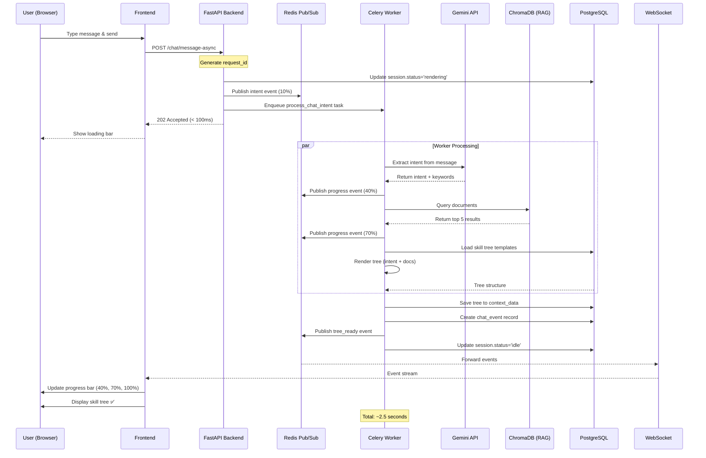
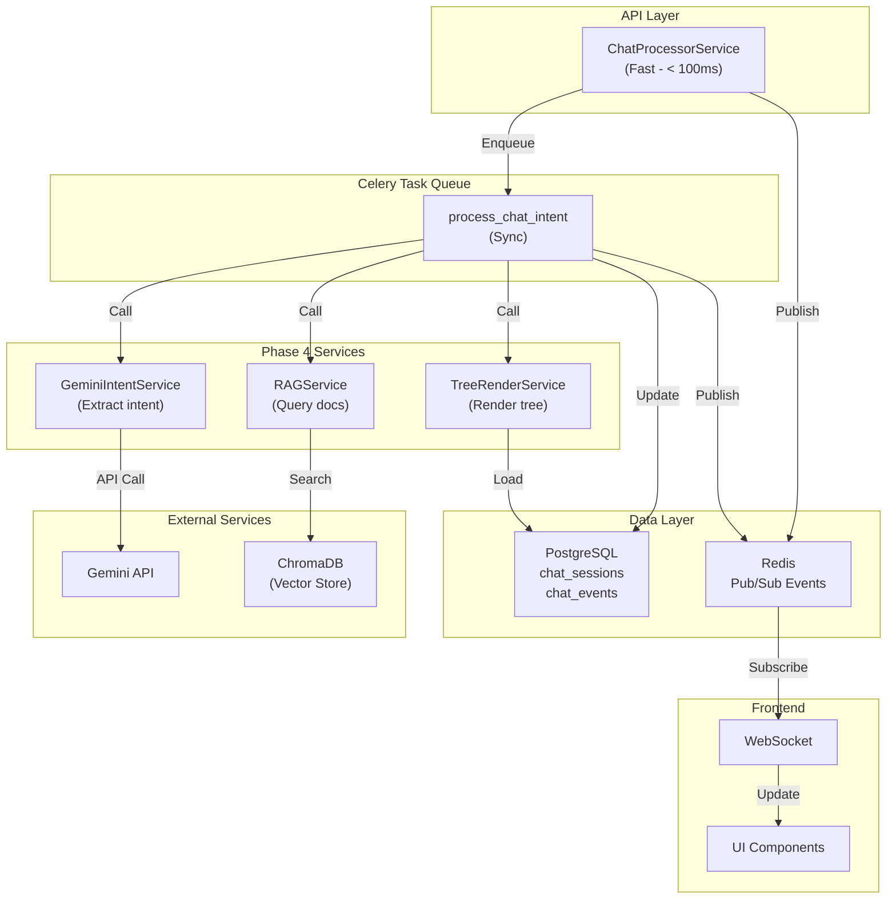
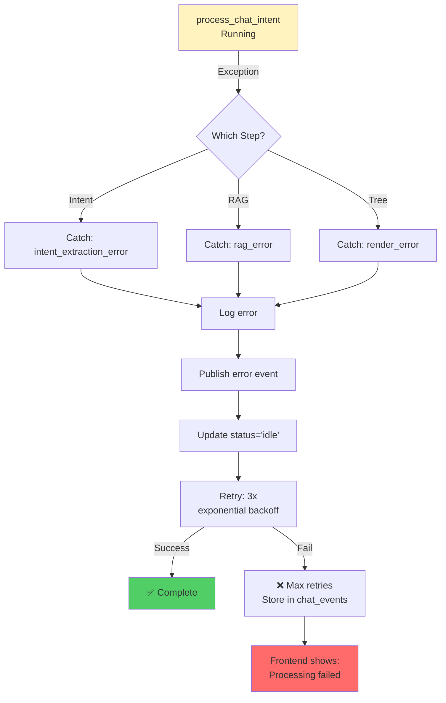
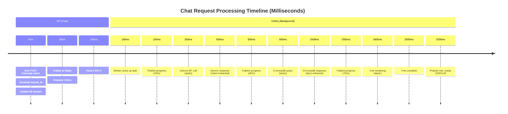

# Comprehensive Mermaid Diagrams

## 1. User Request to Tree Rendering Flow



## 2. Phase 4 Service Architecture



## 3. Redis Event Publishing Sequence

```mermaid
graph LR
    A["Celery Task Starts<br/>Status: rendering"] 
    B["Pub: intent (10%)"]
    C["Gemini Extract"]
    D["Pub: progress (40%)"]
    E["RAG Query"]
    F["Pub: progress (70%)"]
    G["Tree Render"]
    H["Pub: ready<br/>Status: idle"]

    A -->|~50ms| B
    B -->|~350ms| C
    C -->|~50ms| D
    D -->|~950ms| E
    E -->|~50ms| F
    F -->|~950ms| G
    G -->|~50ms| H

    style A fill:#ff6b6b
    style B fill:#ffd43b
    style C fill:#74c0fc
    style D fill:#ffd43b
    style E fill:#74c0fc
    style F fill:#ffd43b
    style G fill:#74c0fc
    style H fill:#51cf66
```



## 4. Error Handling Flow



## 5. Database State Transitions

```mermaid
stateDiagram-v2
    [*] --> idle: Session created

    idle --> rendering: POST /message-async<br/>Task enqueued

    rendering --> error: Exception at any step
    rendering --> idle: Task completes (tree_ready)

    error --> idle: Error event published<br/>Status reset
    
    idle --> [*]

    note right of rendering
        Status: "rendering"
        Duration: ~2.5s
        Progress events: 10%, 40%, 70%
    end

    note right of error
        Auto-retry: 3x
        Error logged to chat_events
    end
```

## 6. Timing & Performance



## 7. Service Dependencies

```mermaid
graph TB
    subgraph "Chat Module"
        CP["ChatProcessorService"]
        CT["Celery Task"]
    end

    subgraph "New Services (Phase 4)"
        GIS["GeminiIntentService"]
        RAGS["RAGService"]
        TRS["TreeRenderService"]
    end

    subgraph "Existing Services"
        GA["GeminiAdapter"]
        CA["ChromaAdapter"]
        ST["SkillTreeService"]
    end

    subgraph "Infrastructure"
        Redis["RedisEventManager"]
        DB["ChatRepository"]
    end

    CP -.->|enqueues| CT
    CT -->|calls| GIS
    CT -->|calls| RAGS
    CT -->|calls| TRS
    
    GIS -->|uses| GA
    RAGS -->|uses| CA
    TRS -->|uses| ST
    
    CT -->|publishes via| Redis
    CT -->|updates| DB
    CT -->|loads from| DB
```



---

**All diagrams ready for reference during Phase 4 implementation!**
