# NexusAI Database Schema

## ERD Diagram

```mermaid
erDiagram
    %% ==================== USERS ====================
    users {
        uuid id PK
        varchar email UK
        varchar username UK
        varchar password_hash
        varchar full_name
        varchar avatar_url
        timestamp created_at
        timestamp updated_at
        timestamp last_login_at
        boolean is_active
    }

    %% ==================== CHAT ====================
    chat_sessions {
        uuid id PK
        uuid user_id FK
        varchar title
        timestamp created_at
        timestamp updated_at
    }

    messages {
        uuid id PK
        uuid session_id FK
        varchar role "user|assistant|system"
        text content
        timestamp created_at
    }

    %% ==================== SKILL TREE TEMPLATE ====================
    skill_tree_templates {
        uuid id PK
        varchar name
        text description
        varchar category
        varchar icon
        varchar color
        boolean is_active
        timestamp created_at
    }

    template_skill_nodes {
        uuid id PK
        uuid template_id FK
        varchar name
        text description
        varchar icon
        varchar color
        varchar difficulty_level
        integer estimated_hours
        integer position_x
        integer position_y
    }

    template_skill_paths {
        uuid ancestor_id PK,FK
        uuid descendant_id PK,FK
        integer depth
    }

    %% ==================== USER SKILL TREE ====================
    user_skill_trees {
        uuid id PK
        uuid user_id FK
        uuid template_id FK
        varchar name
        text description
        timestamp created_at
    }

    user_skill_nodes {
        uuid id PK
        uuid tree_id FK
        uuid original_node_id FK
        varchar name
        text description
        varchar status "not_started|in_progress|completed"
        integer progress_percent
        integer position_x
        integer position_y
        timestamp started_at
        timestamp completed_at
    }

    user_skill_paths {
        uuid ancestor_id PK,FK
        uuid descendant_id PK,FK
        integer depth
    }

    %% ==================== LEARNING ====================
    learning_resources {
        uuid id PK
        uuid skill_node_id FK
        varchar title
        varchar url
        varchar resource_type
        varchar platform
        integer estimated_duration
        boolean is_free
    }

    learning_progress {
        uuid id PK
        uuid user_id FK
        uuid resource_id FK
        varchar status
        integer progress_percent
        text notes
        integer rating
        timestamp started_at
        timestamp completed_at
    }

    study_sessions {
        uuid id PK
        uuid user_id FK
        uuid resource_id FK
        timestamp started_at
        timestamp ended_at
        integer duration_minutes
        text notes
    }

    timeline_items {
        uuid id PK
        uuid user_id FK
        uuid resource_id FK
        date scheduled_date
        date deadline
        varchar priority
    }

    reminders {
        uuid id PK
        uuid user_id FK
        uuid resource_id FK
        timestamp reminder_at
        text message
        boolean is_sent
    }

    %% ==================== FORUM ====================
    forum_categories {
        uuid id PK
        varchar name
        varchar slug UK
        text description
        integer sort_order
    }

    forum_posts {
        uuid id PK
        uuid category_id FK
        uuid user_id FK
        varchar title
        text content
        integer view_count
        boolean is_pinned
        boolean is_locked
    }

    forum_comments {
        uuid id PK
        uuid post_id FK
        uuid user_id FK
        uuid parent_id FK
        text content
        timestamp created_at
    }

    post_likes {
        uuid user_id PK,FK
        uuid post_id PK,FK
        timestamp created_at
    }

    %% ==================== JOBS ====================
    jobs {
        uuid id PK
        varchar title
        varchar company
        varchar location
        varchar job_type
        varchar experience_level
        integer salary_min
        integer salary_max
        text description
        boolean is_active
    }

    job_skills {
        uuid job_id PK,FK
        uuid skill_node_id PK,FK
        boolean is_required
    }

    user_skills {
        uuid user_id PK,FK
        uuid skill_node_id PK,FK
        integer proficiency_level
        boolean is_interested
    }

    %% ==================== RELATIONSHIPS ====================
    users ||--o{ chat_sessions : "has"
    chat_sessions ||--o{ messages : "contains"

    users ||--o{ user_skill_trees : "owns"
    skill_tree_templates ||--o{ user_skill_trees : "cloned_from"
    skill_tree_templates ||--o{ template_skill_nodes : "contains"
    template_skill_nodes ||--o{ template_skill_paths : "in_hierarchy"

    user_skill_trees ||--o{ user_skill_nodes : "contains"
    user_skill_nodes ||--o{ user_skill_paths : "in_hierarchy"
    template_skill_nodes ||--o{ user_skill_nodes : "original"

    template_skill_nodes ||--o{ learning_resources : "has"
    users ||--o{ learning_progress : "tracks"
    learning_resources ||--o{ learning_progress : "tracked_by"

    users ||--o{ study_sessions : "logs"
    users ||--o{ timeline_items : "schedules"
    users ||--o{ reminders : "sets"

    forum_categories ||--o{ forum_posts : "contains"
    users ||--o{ forum_posts : "creates"
    users ||--o{ forum_comments : "writes"
    forum_posts ||--o{ forum_comments : "has"
    forum_comments ||--o{ forum_comments : "replies_to"
    users ||--o{ post_likes : "gives"
    forum_posts ||--o{ post_likes : "receives"

    jobs ||--o{ job_skills : "requires"
    template_skill_nodes ||--o{ job_skills : "used_in"
    users ||--o{ user_skills : "has"
    template_skill_nodes ||--o{ user_skills : "rated_by"
```



---

## Giải Thích Các Bảng

### 1. Users & Authentication

| Bảng | Mô tả |
|------|-------|
| `users` | Thông tin người dùng: email, username, password, avatar |

---

### 2. Chat & Conversations

| Bảng | Mô tả |
|------|-------|
| `chat_sessions` | Phiên chat của user với AI |
| `messages` | Tin nhắn trong phiên chat (user/assistant) |

---

### 3. Skill Tree Template (Admin tạo)

| Bảng | Mô tả |
|------|-------|
| `skill_tree_templates` | Cây kỹ năng mẫu (VD: Frontend Roadmap, Backend Roadmap) |
| `template_skill_nodes` | Các node trong template (VD: HTML, CSS, JavaScript) |
| `template_skill_paths` | **Closure Table** - Lưu quan hệ cha-con giữa các node template |

**Cách hoạt động Closure Table:**
```
ancestor_id = 1, descendant_id = 5, depth = 2
→ "Node 1 là ông (2 cấp trên) của node 5"
```

---

### 4. User Skill Tree (Mỗi user có cây riêng)

| Bảng | Mô tả |
|------|-------|
| `user_skill_trees` | Cây kỹ năng của từng user (clone từ template hoặc tự tạo) |
| `user_skill_nodes` | Node trong cây user, có `status` và `progress_percent` |
| `user_skill_paths` | **Closure Table** - Quan hệ cha-con trong cây của user |

---

### 5. Learning Resources & Progress

| Bảng | Mô tả |
|------|-------|
| `learning_resources` | Tài liệu học (video, article, course...) gắn với skill |
| `learning_progress` | Tiến độ học của user với từng tài liệu |
| `study_sessions` | Phiên học - tracking thời gian bắt đầu/kết thúc |
| `timeline_items` | Lịch học - đặt ngày học, deadline, priority |
| `reminders` | Nhắc nhở học tập |

---

### 6. Forum

| Bảng | Mô tả |
|------|-------|
| `forum_categories` | Danh mục forum (General, Q&A, Career...) |
| `forum_posts` | Bài viết trong forum |
| `forum_comments` | Bình luận (hỗ trợ reply với `parent_id`) |
| `post_likes` | Like bài viết |

---

### 7. Jobs

| Bảng | Mô tả |
|------|-------|
| `jobs` | Việc làm: title, company, salary, requirements |
| `job_skills` | Skill yêu cầu cho job (để matching) |
| `user_skills` | Skill của user (proficiency level 1-5) để matching job |

---

## Flow Hoạt Động

```
┌────────────────────────────────────────────────────────────┐
│                      ADMIN                                  │
│  Tạo Template: "Frontend Developer"                        │
│  └── skill_tree_templates + template_skill_nodes           │
└────────────────────────────────────────────────────────────┘
                           │
                           ▼ Clone
┌────────────────────────────────────────────────────────────┐
│                      USER A                                 │
│  Clone → user_skill_trees + user_skill_nodes               │
│  ├── HTML ✅ 100%                                          │
│  ├── CSS 🔄 70%                                            │
│  └── JavaScript ⏳ 0%                                       │
│                                                            │
│  Học tập → learning_progress, study_sessions               │
│  Đặt lịch → timeline_items, reminders                      │
└────────────────────────────────────────────────────────────┘
```
